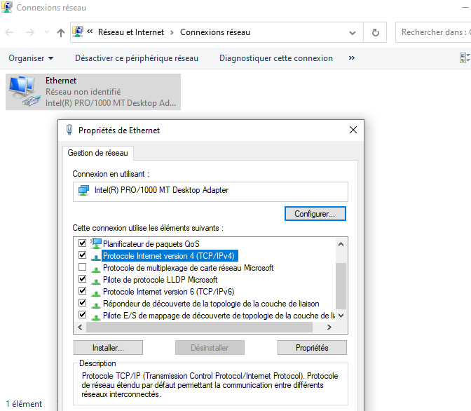
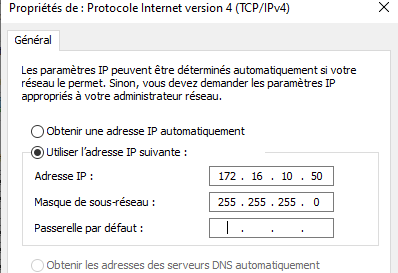
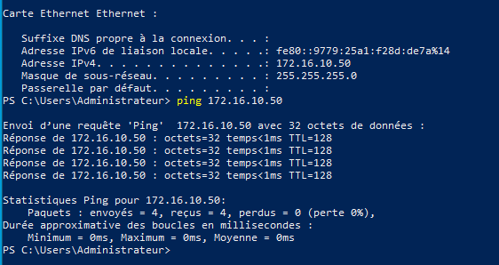
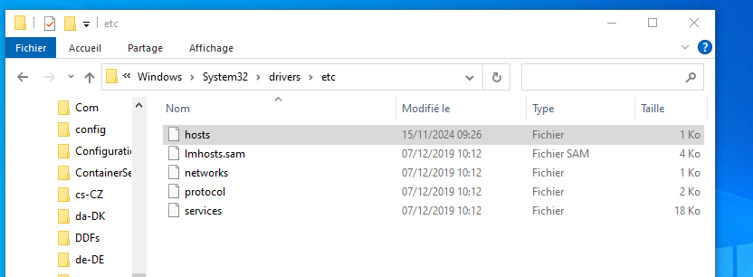
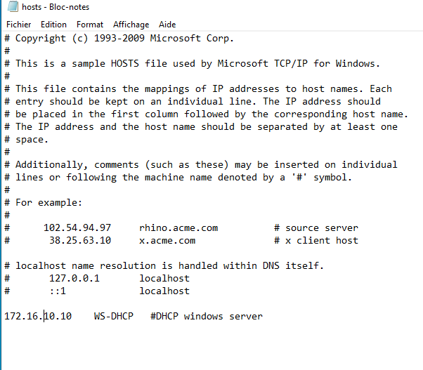
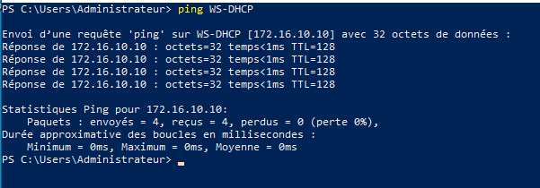
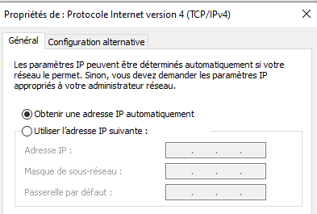
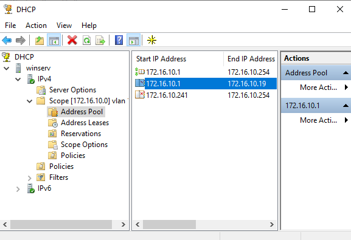
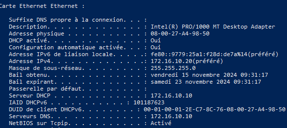
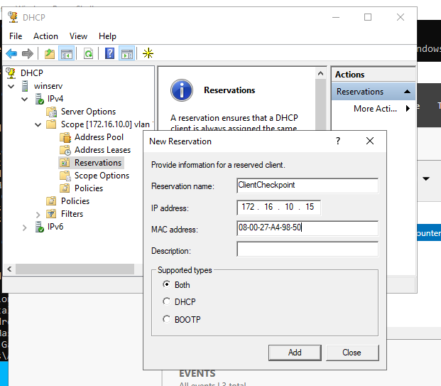

### EXERCICE 1 

1.  
Les adresses ne sont pas sur le même réseau.  
Un réseau est en 172.16.100.x l'autre en 172.16.10.x  
  
  
  

2.  
Modifier le fichier host 
  
  
  

3.   
La plage d'adresse de 172.16.10.1 à 172.16.10.19 est exclue de l'adressage.  
Le client récupère donc la .20, qui est la première adresse disponible dans la plage.  

  
  
 

4.  
Réserver une adresse en fonction de l'adresse mac

  

